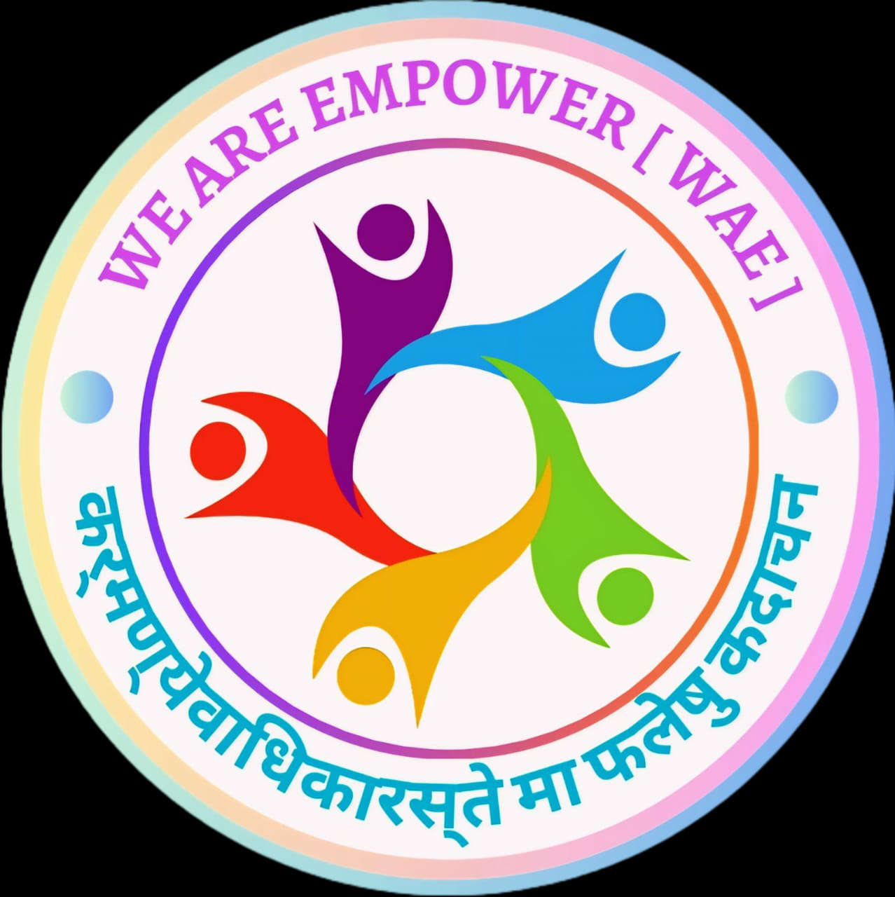

<html lang="en">
<head>
    <meta charset="UTF-8">
    <title>We Are Empower Foundation</title>
    
</head>
<body>

    <header>
        
        <h1>WE ARE EMPOWER FOUNDATION</h1>
        <h2>WE'RE DESIGNING THE FUTURE</h2>
        
We Are Empower, every step forward is a step toward self-belief.

        <button class="highlight-btn">Proud to be part of WAE INDIA</button>
        

            
            
            
        

    </header>

    

        

            <h2>NATIONAL LEVEL NGO</h2>
            
Government of India Recognized

            
When volunteers unite, change is no longer a dream, it becomes a movement.

            

                

                    
                    <h3>Indian Society</h3>
                    
A strong society begins where every voice is heard and every hand is held.

                

                

                    
                    <h3>Nation First</h3>
                    
Before self, before gain, always, the nation remains.

                

                

                    
                    <h3>Education</h3>
                    
Learning today, leading tomorrow.

                

            

        

        

            <h2>MESSAGE FROM, WE ARE EMPOWER</h2>
            
At We Are Empower, we believe that empowerment is not a one-way process; it is a shared journey of growth, inclusion, and transformation. Our mission is to reach the most vulnerable and marginalized sections of society, not with sympathy, but with tools, knowledge, and confidence to help them lead dignified, independent lives.

            
Our vision is to build a society where no dream is too big, and no background is too small. We believe real change happens when opportunities are accessible to all regardless of caste, gender, location, or economic background. Through skill development, educational support, digital awareness, and confidence-building programs, we create sustainable change at the grassroots level.

            
We facilitate free, government-certified courses under the Skill India Mission, charge minimal registration and management fees, and provide lifelong support through consulting, technical help, and confidence building.

            
We conduct workshops, health awareness camps, digital literacy drives, women self-help initiatives, and career guidance programs. We work with schools, panchayats, local communities, and volunteers to ensure our mission reaches every corner.

            
We aim to create changemakers who can rise above their circumstances and uplift others. This ripple effect is the heartbeat of our foundation.

            
To all supporters and future partners: your contribution—time, resources, or skills—can help transform lives. Let us unite to create a more empowered, educated, and self-reliant India.

            
Together, We Are Empower

            
Warm regards, Vaibhav Thakur, Gujarat Founder & M.D. of We Are Empower

        

        

            <h2>We Are Empower  World Recorded in United Nations</h2>

            

                

                    
                    <h3>Mission Smile</h3>
                    
A smile shared is a life empowered.

                

                

                    
                    <h3>Education for All</h3>
                    
Every child. Every village. Education for all.

                

                

                    
                    <h3>Unity is Everything</h3>
                    
In unity, we find strength. In togetherness, we create change.

                

                

                    
                    <h3>Mission Skill India</h3>
                    
Skilling India, empowering futures.

                

            

        

        

            <h2>TYPES OF WAE</h2>
            

                
                
                
                
                
                
                
                
                
            

            
WAE Academy ensures Education for All, while the Digital Academy equips youth with modern skills. The Medical Wing spreads health awareness and care. The Organization Committee manages planning and execution across India.

            
The Art Academy, Color Studio, and Creative Team nurture creativity, while THYNK WAE drives innovation. The Environment Project promotes green living and sustainability. The State Teams mobilize local impact across regions.

            
WAE also conducts live events, operates WAE Collections for identity-driven merchandise, and supports learning through WAE Consulting and Editing Team services. The Administrative Wing ensures strong internal governance, while the Elite Club honors excellence in service.

            
Together, these units form a powerful movement that uplifts communities, especially the underprivileged, through knowledge, action, and unity. We Are Empower is more than an NGO — it’s a mission to transform India, one life at a time.

            
Contact: <a href="mailto:weareempowerindia@gmail.com">weareempowerindia@gmail.com</a>

        

        

            
Social work is not about charity, it's about dignity. It's about seeing people not as problems, but as potential. Every kind word, every helping hand plants the seed of change. Change doesn't begin in offices, it begins on the ground, and those who serve become the light in someone’s darkness.

            
True service uplifts both the giver and the receiver. In serving others, we find the deepest meaning of life.

            
You don’t need to be rich to serve; you just need to care. Every act of compassion is a ripple that can change the world. Because the world needs fewer critics and more helpers.

            
"Social work is not just a profession, it's a calling to make lives better, one soul at a time."

            
            
Dear Students, You are the creators of tomorrow—the minds that imagine, the hands that build, and the hearts that inspire. Your creativity is a tool to shape the world. Whether you express through art, technology, ideas, or action, your skills are powerful.

            
Let’s create. Let’s grow. Let’s empower, together. Because your talent deserves a platform, and your future deserves a mission.

            
We Are Empower, with you, for you.

        

    

    <footer>
        &copy; 2025 We Are Empower Foundation. All rights reserved.
    </footer>

</body>
</html>
